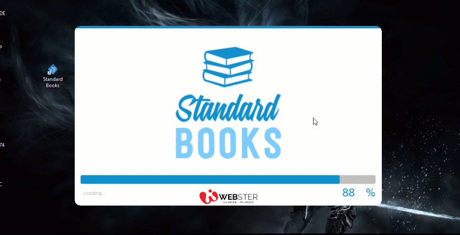

# Database Project
This was my third semester project of course ‘Relational Database Management System’. In this project, I developed a real world Book Store Management System for a company Standard Books. Using C#/ MS SQL Server/ Crystal Reports. Check out demo.

# About Project
- **Framework:** .Net Framework 4.5
- **IDE Tool:** Visual Studio 2015
- **Project Type:** Desktop Application
- **Database:** Microsoft SQL Server 2014
- **Reports** Crystal Reports  

# Pre required
- .Net Framework 4.5
- MS SQL Server 2014 
- SAP Crystal Reports (version: 13.0.18)
